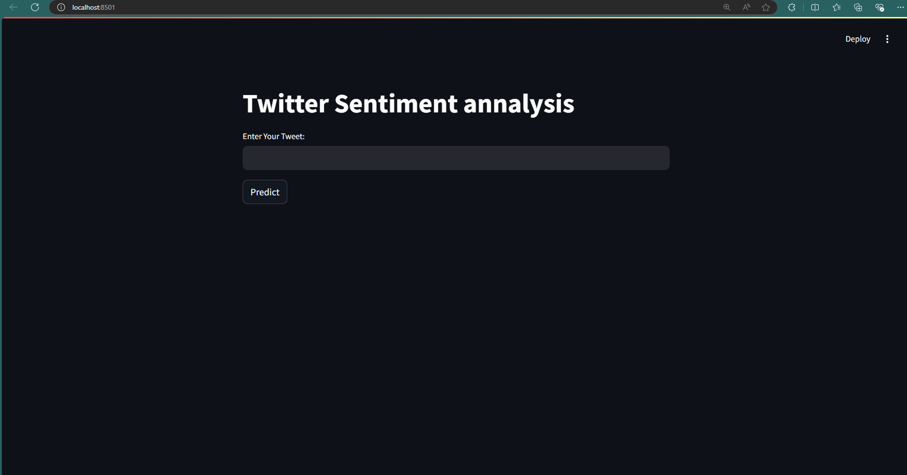

TweetSentiment is a Python-based application that classifies the sentiment of tweets using a pre-trained machine learning model
## Live Demo
You can view the live project [here](https://tweetsentiment-by-susovan.streamlit.app/).

.png  "Screenshot of TweetSentiment in action")
.png  "Screenshot of TweetSentiment in action")
.png  "Screenshot of TweetSentiment in action")
